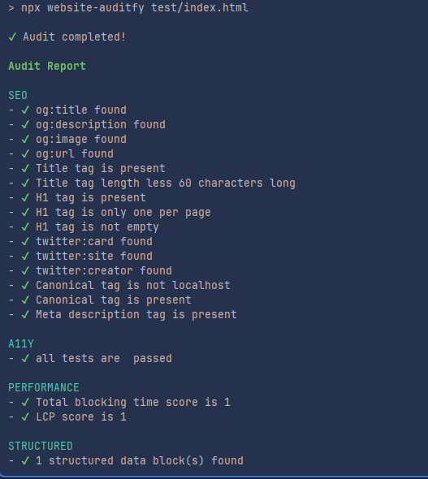

# website-auditfy

> Tool for validate your website on SEO, Performance, Accessibility, HTML, CSS and JS

[](https://github.com/semantic-release/semantic-release)
[](https://www.npmjs.com/package/website-auditfy)
[](https://www.npmjs.com/package/website-auditfy)

## Table of Contents

- [Background](#background)
- [Installation](#installation)
- [Usage](#usage)
- [Contribute](#contribute)
- [License](#license)

## Background 

Current each developer using a lot of tools for checking accessibility, SEO, performance and html validation. (like lighthouse, page speed, wave and e.t.c)
This application try to merge all of them to one tool with simplify using. 

### Included

This tool included following modules: 

- HTML  -  `status: 81 Rules.` [List of html rules](/docs/rules/html.rules.md)
- CSS  -  `status: to be continue`
- JavaScript - `status: 100+ Rules from eslint. To be continue`
- Security - `status: 16 Rules.` [List of security rules](/docs/rules/security.rules.md)
- SEO  - `status: 17 Rules`[List of SEO rules](/docs/rules/seo.rules.md)
- Performance  - `status: 5 rules and to be continue`
- Accessibility check  -  `status: 83 Rules to be continue`

| Module\Mode    | URL | Static |
|:---------------|:----|:-------|
| SEO            | ☑   | ☑      |
| Performance    | ☑   | ☑      |
| Accessibility  | ☑   | ☑      |
| HTML           | ☑   | ☑      |
| CSS            | ☓   | ☑      |
| Security       | ☑   | ☑      |
| JavaScript     | ☓   | ☑      |


### Future:
- TS Validation
- Configuration modules
- Configuration rules
- Custom rule or module
- mode `production` or `develop`
- AI integration
- and e.t.c

### Note 
> Because this tool have a lot of rules. All rules on `warning` by default (temporarily)

## Installation

Required: 
```angular2html
- Node v20+
- `Google Chrome` or `chrome-launcher' for `puppeteer`
```

How to set up `chrome-launher` for your CI/CD see example [here](./docs/chrome-launcher.md)

```bash
npm install website-auditfy 
```

```bash
yarn add website-auditfy
```

```bash
pnpm add website-auditfy
```

## Usage

```bash
npx website-auditfy path/to/index.html

or

npx website-auditfy https://github.com/
```

## Output

#### Example output 


The CLI process may exit with the following codes:


- 0: Audit succeeded without errors (warnings may have occurred)
- 1: Audit failed with one or more rule violations with severity error
- 2: An invalid command line argument or combination thereof was used

## Contribute

## License

Apache